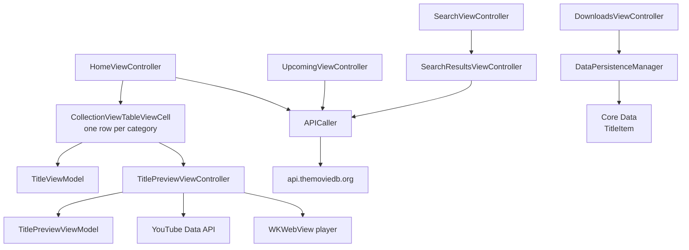
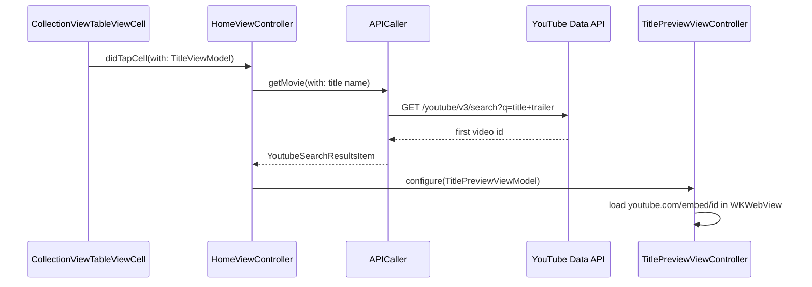

# Netflix Clone

*A streaming catalogue on the TMDB API, with trailer playback and offline downloads in Core Data.*

     

https://github.com/user-attachments/assets/6dd40a5d-673b-428a-89d1-3aed2ae1411b

## Overview

A home screen of horizontally scrolling category rows, an upcoming list, search with live results,
and a downloads tab backed by Core Data. Selecting a title opens a preview screen that plays its
trailer, found by querying the YouTube Data API with the title name.

## Architecture



## From a poster tap to a playing trailer



The cell does not present anything itself. It reports the tap through a delegate, the controller
resolves the trailer, and only then is the preview screen configured. This keeps the cell reusable and
free of navigation code.

## Implementation notes

- **One table, many collections.** The home screen is a table view where each row hosts its own
  horizontal collection view, which is how the sectioned poster layout is achieved without nesting
  scroll views by hand.
- **Downloads as Core Data.** `DataPersistenceManager` writes a `TitleItem` entity, reports success or
  a typed error, and posts a notification so the downloads tab refreshes without polling.
- **Header that responds to scroll.** `HeroHeaderUIView` layers a gradient over the artwork so the
  navigation bar stays readable while the content scrolls beneath it.
- **View models at the boundary.** Controllers pass `TitleViewModel` and `TitlePreviewViewModel`
  rather than raw API types, so a change in the API shape does not reach the views.
- **Search results as a child.** `SearchResultsViewController` is used as the results controller of a
  `UISearchController`, so the search screen holds no duplicate collection view code.

## Project structure

```
Netflix/
├── Managers/       APICaller, DataPersistenceManager
├── Models/         Title, YoutubeSearchResponse
├── ViewModels/     TitleViewModel, TitlePreviewViewModel
├── Controllers/    Core tabs and General preview screen
├── Views/          HeroHeaderUIView, CollectionViewTableViewCell, poster cells
└── NetflixModel.xcdatamodeld
```

## Requirements

Xcode 15 or later, iOS 17.4 or later, Swift Package Manager for SDWebImage. A TMDB API key and a
YouTube Data API key are required.
